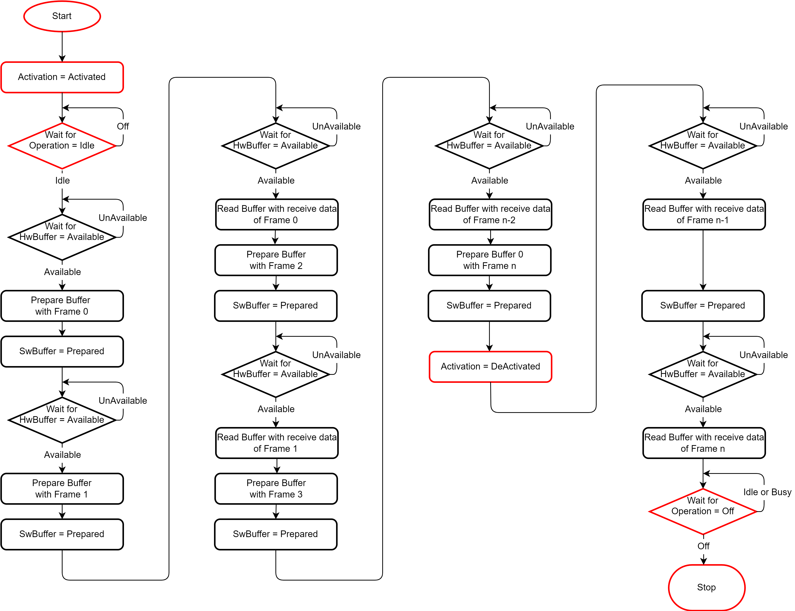
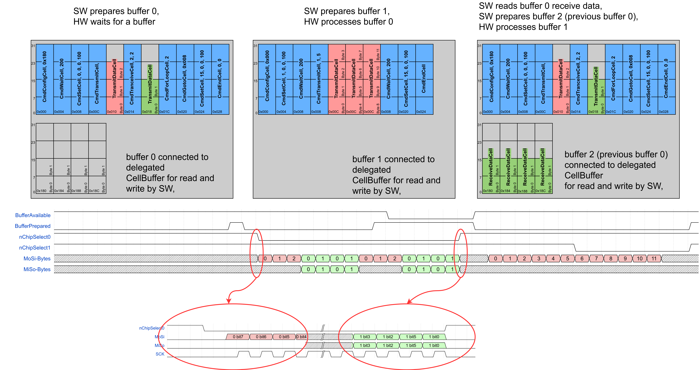

..
 Copyright (C) 2023 Eccelerators GmbH

..
 

..
 This code was generated by:

..
 

..
 HxS Compiler v0.0.0-0000000

..
 Docs Extension for HxS v0.0.0-0000000

..
 

..
 Further information at https://eccelerators.com/hxs

..
 

..
 Changes to this file may cause incorrect behavior and will be lost if the

..
 code is regenerated.

..
 

..
 

..
 Author:HxS Compiler

..
 Date:25 Jul 2023 15:07:06

Spi Controller Interface (SpiControllerIfc)
"""""""""""""""""""""""""""""""""""""""""""
Interface containing a basic SPI controller block.
 
        
    .. |.Activation....| replace:: `Activation <a853040979d4_>`__
    .. |.Activated....| replace:: `Activated <aa74e75a2c72_>`__
    .. |.DeActivated....| replace:: `DeActivated <acc58c7cbcc5_>`__
     
    .. |.SwBuffer....| replace:: `SwBuffer <a9f72109fc98_>`__
    .. |.Prepared....| replace:: `Prepared <a7c7fd2a3e09_>`__
 
    .. |.StatusReg....| replace:: `StatusReg <ae8059912c94_>`__
    .. |.Operation....| replace:: `HwBuffer <a257d778cefd_>`__
    .. |.Off....| replace:: `Off <a7cad459038a_>`__
    .. |.Idle....| replace:: `Idle <a586a8b0e9c4_>`__
    .. |.Busy....| replace:: `Busy <a6f87b722baf_>`__
     
    .. |.HwBuffer....| replace:: `HwBuffer <a257d778cefd_>`__
    .. |.Available....| replace:: `Available <a90001c75d72_>`__
    .. |.UnAvailable....| replace:: `UnAvailable <a6fe46dff400_>`__                              
 
    .. |.dlgCellBffr....| replace:: `CellBuffer <a23805ab0243_>`__
    .. |.regCmdCfg....| replace:: `CmdConfigCell <ae5116637470_>`__
    .. |.regCmdTrm....| replace:: `CmdTransmitCell <a1a7d4084fc1_>`__
    .. |.regCmdTrcv....| replace:: `CmdTransceiveCell <ac2c588b6da1_>`__
    .. |.regCmdGoto....| replace:: `CmdGotoCell <a1c19719ba6a_>`__
    .. |.datForCnt....| replace:: `ForLoopCount <a8d1d0a96dcd_>`__
 
    .. |.AddrToGt....| replace:: `AddressToGoto <adcace676bdd_>`__    
    .. |.AutRstrt....| replace:: `AutoRestart <a6db81fe50e3_>`__
    
 
 
 

.. table:: Blocks of Spi Controller Interface

 +----------------------------------------------------------------------------------------------------------------------------------------------------------------------------------------------------------+
 |Blocks of Spi Controller Interface                                                                                                                                                                        |
 |                                                                                                                                                                                                          |
 +-----------------+----------------+-----------------------------------------------------------------------------------------------------------------------------------------------------------------------+
 |Block Address    |ID              |Block Name                                                                                                                                                             |
 |                 |                |                                                                                                                                                                       |
 +-----------------+----------------+-----------------------------------------------------------------------------------------------------------------------------------------------------------------------+
 || ``0x0000``     |SpiControllerBlk|`Spi Controller Block <a20d26ae1344_>`__                                                                                                                               |
 |                 |                |                                                                                                                                                                       |
 |.. _a33699cebfeb:|                |                                                                                                                                                                       |
 |                 |                |                                                                                                                                                                       |
 +-----------------+----------------+-----------------------------------------------------------------------------------------------------------------------------------------------------------------------+

| 

.. table:: Resets of Spi Controller Interface

 +---------------------------------------------------------------------------------------------------------------------------------------------------------------------------------------------------------+
 |Resets of Spi Controller Interface                                                                                                                                                                       |
 |                                                                                                                                                                                                         |
 +-----------------+---------------------------------------------------------------------------------------------------------------------------------------------------------------------------------------+
 |ID               |Reset Name                                                                                                                                                                             |
 |                 |                                                                                                                                                                                       |
 +-----------------+---------------------------------------------------------------------------------------------------------------------------------------------------------------------------------------+
 |Rst              |Hardware Reset                                                                                                                                                                         |
 |                 |                                                                                                                                                                                       |
 |.. _aa2817f1218c:|                                                                                                                                                                                       |
 |                 |                                                                                                                                                                                       |
 +-----------------+---------------------------------------------------------------------------------------------------------------------------------------------------------------------------------------+

| 

Spi Controller Block (SpiControllerBlk)
~~~~~~~~~~~~~~~~~~~~~~~~~~~~~~~~~~~~~~~
This block defines a basic SPI controller to connect general purpose peripheral SPI devices e.g.,
analog to digital converters, digital to analog converters and IO-port extenders.
 
Constraints:
 
1. Spend a dual ported RAM vendor IP instance to hold controller specific commands, transmit data
   and receive data.
2. Partition the RAM into two equally sized **buffers**, each to hold one transmit command/data frame and a
   corresponding receive data frame.
3. Allow a continuous flow of data between SW and HW by indicating the availibilty/preparation of a buffer by semaphores.
4. Provide commands to solve usual SPI transmit and receive tasks chained in a frame.
5. Give the possibilty to adapt this basic Spi controller block by means of inheritance to e.g, different buffer sizes,
   different packet lengths, repeating multipiers, dual or quad SPI-modes or to add interrupt capability.
6. Allow to process buffer data repeatedly in background by HW and exchange buffers only when SW wants to pay attenetion.
7. Allow to process intitally present data after reset autonomously by setting the reset values of respective
   control bits and preloading the buffers with respective transmit commands and data.
 
SW-operation flow:
 

 
HW-operation flow:
 

 
 
 
 

.. table:: Registers or Delegates of Spi Controller Block

 +----------------------------------------------------------------------------------------------------------------------------------------------------------------------------------------------------------+
 |Registers or Delegates of Spi Controller Block                                                                                                                                                            |
 |                                                                                                                                                                                                          |
 +-----------------------------------+----------------------------------------------------------------------------------------------------------------------------------------------------------------------+
 || ``0x0000``                       |`Spi Controller Block <a33699cebfeb_>`__                                                                                                                              |
 || ``..``                           |                                                                                                                                                                      |
 || ``0x07ff``                       |                                                                                                                                                                      |
 |                                   |                                                                                                                                                                      |
 |.. _a20d26ae1344:                  |                                                                                                                                                                      |
 |                                   |                                                                                                                                                                      |
 +-----------------+-----------------+----------------------------------------------------------------------------------------------------------------------------------------------------------------------+
 |Address          |ID               |Name                                                                                                                                                                  |
 |                 |                 |                                                                                                                                                                      |
 +-----------------+-----------------+----------------------------------------------------------------------------------------------------------------------------------------------------------------------+
 || ``0x0000``     |CellBuffer       |`Cell Buffer <a23805ab0243_>`__                                                                                                                                       |
 |                 |                 |                                                                                                                                                                      |
 |.. _a038a310f98c:|                 |                                                                                                                                                                      |
 |                 |                 |                                                                                                                                                                      |
 +-----------------+-----------------+----------------------------------------------------------------------------------------------------------------------------------------------------------------------+
 || ``0x0000``     |CmdConfigCell    |`Command Config Cell <ae5116637470_>`__                                                                                                                               |
 |                 |                 |                                                                                                                                                                      |
 |.. _a3768394f0bd:|                 |                                                                                                                                                                      |
 |                 |                 |                                                                                                                                                                      |
 +-----------------+-----------------+----------------------------------------------------------------------------------------------------------------------------------------------------------------------+
 || ``0x0000``     |CmdSetCell       |`Command Set Cell <a546970a1b52_>`__                                                                                                                                  |
 |                 |                 |                                                                                                                                                                      |
 |.. _a737c858e5de:|                 |                                                                                                                                                                      |
 |                 |                 |                                                                                                                                                                      |
 +-----------------+-----------------+----------------------------------------------------------------------------------------------------------------------------------------------------------------------+
 || ``0x0000``     |CmdTransmitCell  |`Command Transmit Cell <a1a7d4084fc1_>`__                                                                                                                             |
 |                 |                 |                                                                                                                                                                      |
 |.. _a0089782d5b2:|                 |                                                                                                                                                                      |
 |                 |                 |                                                                                                                                                                      |
 +-----------------+-----------------+----------------------------------------------------------------------------------------------------------------------------------------------------------------------+
 || ``0x0000``     |CmdTransceiveCell|`Command Tranceive Cell <ac2c588b6da1_>`__                                                                                                                            |
 |                 |                 |                                                                                                                                                                      |
 |.. _a20a2f099cc4:|                 |                                                                                                                                                                      |
 |                 |                 |                                                                                                                                                                      |
 +-----------------+-----------------+----------------------------------------------------------------------------------------------------------------------------------------------------------------------+
 || ``0x0000``     |CmdWaitCell      |`Command Wait Cell <aeca39bc0f7d_>`__                                                                                                                                 |
 |                 |                 |                                                                                                                                                                      |
 |.. _af8e6dfa3b5a:|                 |                                                                                                                                                                      |
 |                 |                 |                                                                                                                                                                      |
 +-----------------+-----------------+----------------------------------------------------------------------------------------------------------------------------------------------------------------------+
 || ``0x0000``     |CmdGotoCell      |`Command Goto Cell <a1c19719ba6a_>`__                                                                                                                                 |
 |                 |                 |                                                                                                                                                                      |
 |.. _a968768e285d:|                 |                                                                                                                                                                      |
 |                 |                 |                                                                                                                                                                      |
 +-----------------+-----------------+----------------------------------------------------------------------------------------------------------------------------------------------------------------------+
 || ``0x0000``     |CmdForLoopCell   |`Command For Loop Cell <a59580f7cc22_>`__                                                                                                                             |
 |                 |                 |                                                                                                                                                                      |
 |.. _ae10fd1b237b:|                 |                                                                                                                                                                      |
 |                 |                 |                                                                                                                                                                      |
 +-----------------+-----------------+----------------------------------------------------------------------------------------------------------------------------------------------------------------------+
 || ``0x0000``     |CmdEndCell       |`Command End Cell <ad9a6f537e62_>`__                                                                                                                                  |
 |                 |                 |                                                                                                                                                                      |
 |.. _a020f7e92525:|                 |                                                                                                                                                                      |
 |                 |                 |                                                                                                                                                                      |
 +-----------------+-----------------+----------------------------------------------------------------------------------------------------------------------------------------------------------------------+
 || ``0x0000``     |TransmitDataCell |`Transmit Data Cell <aabaae554e8b_>`__                                                                                                                                |
 |                 |                 |                                                                                                                                                                      |
 |.. _a4eac71c1f93:|                 |                                                                                                                                                                      |
 |                 |                 |                                                                                                                                                                      |
 +-----------------+-----------------+----------------------------------------------------------------------------------------------------------------------------------------------------------------------+
 || ``0x0000``     |ReceiveDataCell  |`Receive Data Cell <a4fdefe0824b_>`__                                                                                                                                 |
 |                 |                 |                                                                                                                                                                      |
 |.. _a71024035435:|                 |                                                                                                                                                                      |
 |                 |                 |                                                                                                                                                                      |
 +-----------------+-----------------+----------------------------------------------------------------------------------------------------------------------------------------------------------------------+
 || ``0x0400``     |ControlReg       |`Control Register <ae3b88607883_>`__                                                                                                                                  |
 |                 |                 |                                                                                                                                                                      |
 |.. _a9613b102440:|                 |                                                                                                                                                                      |
 |                 |                 |                                                                                                                                                                      |
 +-----------------+-----------------+----------------------------------------------------------------------------------------------------------------------------------------------------------------------+
 || ``0x0404``     |StatusReg        |`Status Register <ae8059912c94_>`__                                                                                                                                   |
 |                 |                 |                                                                                                                                                                      |
 |.. _a6493e172667:|                 |                                                                                                                                                                      |
 |                 |                 |                                                                                                                                                                      |
 +-----------------+-----------------+----------------------------------------------------------------------------------------------------------------------------------------------------------------------+

Cell Buffer (CellBuffer)
^^^^^^^^^^^^^^^^^^^^^^^^
.. table:: Area of Cell Buffer

 +---------------------------------------------------------------------------------------------------------------------------------------------------------------------------------------------------------+
 |Area of Cell Buffer                                                                                                                                                                                      |
 |                                                                                                                                                                                                         |
 +-----------------+---------------------------------------------------------------------------------------------------------------------------------------------------------------------------------------+
 || ``0x0000``     |`Cell Buffer (CellBuffer) <a038a310f98c_>`__                                                                                                                                           |
 || ``..``         |                                                                                                                                                                                       |
 || ``0x03ff``     |Buffer memory to hold the cells of 4 bytes each of a controller frame.                                                                                                                 |
 |                 |                                                                                                                                                                                       |
 |.. _a23805ab0243:|                                                                                                                                                                                       |
 |                 |                                                                                                                                                                                       |
 +-----------------+---------------------------------------------------------------------------------------------------------------------------------------------------------------------------------------+

Command Config Cell (CmdConfigCell)
^^^^^^^^^^^^^^^^^^^^^^^^^^^^^^^^^^^
Command cell, must be placed start of |.dlgCellBffr....|
 

.. table:: Bits of Command Config Cell

 +-----------------------------------------------------------------------------------------------------------------------------------------------------------------------------------------------------------+
 |Bits of Command Config Cell                                                                                                                                                                                |
 |                                                                                                                                                                                                           |
 +----------------------------------------+------------------------------------------------------------------------------------------------------------------------------------------------------------------+
 || ``0x0000``                            |`Command Config Cell (CmdConfigCell) <a3768394f0bd_>`__                                                                                                           |
 |                                        |                                                                                                                                                                  |
 |.. _ae5116637470:                       |                                                                                                                                                                  |
 |                                        |                                                                                                                                                                  |
 +------+------------------------+--------+------------------------------------------------------------------------------------------------------------------------------------------------------------------+
 |Bits  |ID                      |Type    |Description                                                                                                                                                       |
 |      |                        |        |                                                                                                                                                                  |
 +------+------------------------+--------+------------------------------------------------------------------------------------------------------------------------------------------------------------------+
 || 31  |CmdConfigCellId         |RW      |                                                                                                                                                                  |
 || ..  |                        |        |.. table:: Values of CmdConfigCellId                                                                                                                              |
 || 28  |.. _a6c9c1b1e8e4:       |        |                                                                                                                                                                  |
 |      |                        |        | +-----------------+----------------+--------+-------------------------------------------------------------------------------------------------------------------+|
 |      |                        |        | |Value            |ID              |Type    |Description                                                                                                        ||
 |      |                        |        | |                 |                |        |                                                                                                                   ||
 |      |                        |        | +-----------------+----------------+--------+-------------------------------------------------------------------------------------------------------------------+|
 |      |                        |        | || ``0x0``        |ConfigCellId    |RW      |Command to partiton a buffer.                                                                                      ||
 |      |                        |        | |                 |                |        |                                                                                                                   ||
 |      |                        |        | |.. _a842ea977a58:|                |        |                                                                                                                   ||
 |      |                        |        | |                 |                |        |                                                                                                                   ||
 |      |                        |        | +-----------------+----------------+--------+-------------------------------------------------------------------------------------------------------------------+|
 |      |                        |        |                                                                                                                                                                  |
 |      |                        |        ||                                                                                                                                                                 |
 |      |                        |        |                                                                                                                                                                  |
 +------+------------------------+--------+------------------------------------------------------------------------------------------------------------------------------------------------------------------+
 || 27  |ReceiveFrameStartAddress|RW      |Receive Frame Start Address                                                                                                                                       |
 || ..  |                        |        |                                                                                                                                                                  |
 || 19  |.. _a80adf606289:       |        |Sets the receive frame start byte address in a buffer,                                                                                                            |
 |      |                        |        |the lower 2 bits must be '0'.                                                                                                                                     |
 |      |                        |        |                                                                                                                                                                  |
 +------+------------------------+--------+------------------------------------------------------------------------------------------------------------------------------------------------------------------+
 || 18  |Reserved                |RW      |Reserved, write 0, read don't care                                                                                                                                |
 || ..  |                        |        |                                                                                                                                                                  |
 || 00  |.. _a185b43f1678:       |        |                                                                                                                                                                  |
 |      |                        |        |                                                                                                                                                                  |
 +------+------------------------+--------+------------------------------------------------------------------------------------------------------------------------------------------------------------------+

Command Set Cell (CmdSetCell)
^^^^^^^^^^^^^^^^^^^^^^^^^^^^^
Command cell, can be placed at each 4 byte aligned address in |.dlgCellBffr....|
 

.. table:: Bits of Command Set Cell

 +-----------------------------------------------------------------------------------------------------------------------------------------------------------------------------------------------------------+
 |Bits of Command Set Cell                                                                                                                                                                                   |
 |                                                                                                                                                                                                           |
 +----------------------------------------+------------------------------------------------------------------------------------------------------------------------------------------------------------------+
 || ``0x0000``                            |`Command Set Cell (CmdSetCell) <a737c858e5de_>`__                                                                                                                 |
 |                                        |                                                                                                                                                                  |
 |.. _a546970a1b52:                       |                                                                                                                                                                  |
 |                                        |                                                                                                                                                                  |
 +------+------------------------+--------+------------------------------------------------------------------------------------------------------------------------------------------------------------------+
 |Bits  |ID                      |Type    |Description                                                                                                                                                       |
 |      |                        |        |                                                                                                                                                                  |
 +------+------------------------+--------+------------------------------------------------------------------------------------------------------------------------------------------------------------------+
 || 31  |CmdSetCellId            |RW      |                                                                                                                                                                  |
 || ..  |                        |        |.. table:: Values of CmdSetCellId                                                                                                                                 |
 || 28  |.. _a4989c5ead35:       |        |                                                                                                                                                                  |
 |      |                        |        | +-----------------+----------------+--------+-------------------------------------------------------------------------------------------------------------------+|
 |      |                        |        | |Value            |ID              |Type    |Description                                                                                                        ||
 |      |                        |        | |                 |                |        |                                                                                                                   ||
 |      |                        |        | +-----------------+----------------+--------+-------------------------------------------------------------------------------------------------------------------+|
 |      |                        |        | || ``0x1``        |SetCellId       |RW      |Command to set basic parameters for the following transfers.                                                       ||
 |      |                        |        | |                 |                |        |                                                                                                                   ||
 |      |                        |        | |.. _aa1cf7ee4733:|                |        |                                                                                                                   ||
 |      |                        |        | |                 |                |        |                                                                                                                   ||
 |      |                        |        | +-----------------+----------------+--------+-------------------------------------------------------------------------------------------------------------------+|
 |      |                        |        |                                                                                                                                                                  |
 |      |                        |        ||                                                                                                                                                                 |
 |      |                        |        |                                                                                                                                                                  |
 +------+------------------------+--------+------------------------------------------------------------------------------------------------------------------------------------------------------------------+
 || 27  |ChipSelect              |RW      |Chip Select                                                                                                                                                       |
 || ..  |                        |        |                                                                                                                                                                  |
 || 24  |.. _af797e723b7c:       |        |Sets an active chip select, 15 = no Cs, 0 = Cs0, 1=Cs1, ... 14=Cs14                                                                                               |
 |      |                        |        |                                                                                                                                                                  |
 +------+------------------------+--------+------------------------------------------------------------------------------------------------------------------------------------------------------------------+
 || 23  |ClkPolarity             |RW      |Clock Polarity(CPOL)                                                                                                                                              |
 |      |                        |        |                                                                                                                                                                  |
 |      |.. _a99a613a7e1d:       |        |.. table:: Values of ClkPolarity                                                                                                                                  |
 |      |                        |        |                                                                                                                                                                  |
 |      |                        |        | +-----------------+----------------+--------+-------------------------------------------------------------------------------------------------------------------+|
 |      |                        |        | |Value            |ID              |Type    |Description                                                                                                        ||
 |      |                        |        | |                 |                |        |                                                                                                                   ||
 |      |                        |        | +-----------------+----------------+--------+-------------------------------------------------------------------------------------------------------------------+|
 |      |                        |        | || ``0b1``        |High            |RW      |SCK is high when idle.                                                                                             ||
 |      |                        |        | |                 |                |        |                                                                                                                   ||
 |      |                        |        | |.. _a60618bbcf3f:|                |        |                                                                                                                   ||
 |      |                        |        | |                 |                |        |                                                                                                                   ||
 |      |                        |        | +-----------------+----------------+--------+-------------------------------------------------------------------------------------------------------------------+|
 |      |                        |        | || ``0b0``        |Low             |RW      |SCK is low when idle.                                                                                              ||
 |      |                        |        | |                 |                |        |                                                                                                                   ||
 |      |                        |        | |.. _a38906af3de8:|                |        |                                                                                                                   ||
 |      |                        |        | |                 |                |        |                                                                                                                   ||
 |      |                        |        | +-----------------+----------------+--------+-------------------------------------------------------------------------------------------------------------------+|
 |      |                        |        |                                                                                                                                                                  |
 |      |                        |        ||                                                                                                                                                                 |
 |      |                        |        |                                                                                                                                                                  |
 +------+------------------------+--------+------------------------------------------------------------------------------------------------------------------------------------------------------------------+
 || 22  |ClkPhase                |RW      |Clock Phase(CPHA)                                                                                                                                                 |
 |      |                        |        |                                                                                                                                                                  |
 |      |.. _a95e40456e40:       |        |.. table:: Values of ClkPhase                                                                                                                                     |
 |      |                        |        |                                                                                                                                                                  |
 |      |                        |        | +-----------------+----------------+--------+-------------------------------------------------------------------------------------------------------------------+|
 |      |                        |        | |Value            |ID              |Type    |Description                                                                                                        ||
 |      |                        |        | |                 |                |        |                                                                                                                   ||
 |      |                        |        | +-----------------+----------------+--------+-------------------------------------------------------------------------------------------------------------------+|
 |      |                        |        | || ``0b1``        |Second          |RW      |Sample MiSo with second clock edge after chip select has been activated.                                           ||
 |      |                        |        | |                 |                |        |                                                                                                                   ||
 |      |                        |        | |.. _a31c3eb0237d:|                |        |                                                                                                                   ||
 |      |                        |        | |                 |                |        |                                                                                                                   ||
 |      |                        |        | +-----------------+----------------+--------+-------------------------------------------------------------------------------------------------------------------+|
 |      |                        |        | || ``0b0``        |First           |RW      |Sample MiSo with first clock edge after chip select has been activated.                                            ||
 |      |                        |        | |                 |                |        |                                                                                                                   ||
 |      |                        |        | |.. _a2afbc713649:|                |        |                                                                                                                   ||
 |      |                        |        | |                 |                |        |                                                                                                                   ||
 |      |                        |        | +-----------------+----------------+--------+-------------------------------------------------------------------------------------------------------------------+|
 |      |                        |        |                                                                                                                                                                  |
 |      |                        |        ||                                                                                                                                                                 |
 |      |                        |        |                                                                                                                                                                  |
 +------+------------------------+--------+------------------------------------------------------------------------------------------------------------------------------------------------------------------+
 || 21  |ClkPeriod               |RW      |Clock Period in ns                                                                                                                                                |
 || ..  |                        |        |                                                                                                                                                                  |
 || 12  |.. _add00c3eb79f:       |        |                                                                                                                                                                  |
 |      |                        |        |                                                                                                                                                                  |
 +------+------------------------+--------+------------------------------------------------------------------------------------------------------------------------------------------------------------------+
 || 11  |Reserved                |RW      |Reserved, write 0, read don't care                                                                                                                                |
 || ..  |                        |        |                                                                                                                                                                  |
 || 00  |.. _ab4f319ecd55:       |        |                                                                                                                                                                  |
 |      |                        |        |                                                                                                                                                                  |
 +------+------------------------+--------+------------------------------------------------------------------------------------------------------------------------------------------------------------------+

Command Transmit Cell (CmdTransmitCell)
^^^^^^^^^^^^^^^^^^^^^^^^^^^^^^^^^^^^^^^
Command cell, can be placed at each 4 byte aligned address in |.dlgCellBffr....|
 

.. table:: Bits of Command Transmit Cell

 +-----------------------------------------------------------------------------------------------------------------------------------------------------------------------------------------------------------+
 |Bits of Command Transmit Cell                                                                                                                                                                              |
 |                                                                                                                                                                                                           |
 +----------------------------------------+------------------------------------------------------------------------------------------------------------------------------------------------------------------+
 || ``0x0000``                            |`Command Transmit Cell (CmdTransmitCell) <a0089782d5b2_>`__                                                                                                       |
 |                                        |                                                                                                                                                                  |
 |.. _a1a7d4084fc1:                       |                                                                                                                                                                  |
 |                                        |                                                                                                                                                                  |
 +------+------------------------+--------+------------------------------------------------------------------------------------------------------------------------------------------------------------------+
 |Bits  |ID                      |Type    |Description                                                                                                                                                       |
 |      |                        |        |                                                                                                                                                                  |
 +------+------------------------+--------+------------------------------------------------------------------------------------------------------------------------------------------------------------------+
 || 31  |CmdTransmitCellId       |RW      |                                                                                                                                                                  |
 || ..  |                        |        |.. table:: Values of CmdTransmitCellId                                                                                                                            |
 || 28  |.. _af25b19dd196:       |        |                                                                                                                                                                  |
 |      |                        |        | +-----------------+----------------+--------+-------------------------------------------------------------------------------------------------------------------+|
 |      |                        |        | |Value            |ID              |Type    |Description                                                                                                        ||
 |      |                        |        | |                 |                |        |                                                                                                                   ||
 |      |                        |        | +-----------------+----------------+--------+-------------------------------------------------------------------------------------------------------------------+|
 |      |                        |        | || ``0x2``        |TransmitCellId  |RW      |Command to transmit the following data packet without recording receive data.                                      ||
 |      |                        |        | |                 |                |        |                                                                                                                   ||
 |      |                        |        | |.. _ac2c3d2fe96e:|                |        |                                                                                                                   ||
 |      |                        |        | |                 |                |        |                                                                                                                   ||
 |      |                        |        | +-----------------+----------------+--------+-------------------------------------------------------------------------------------------------------------------+|
 |      |                        |        |                                                                                                                                                                  |
 |      |                        |        ||                                                                                                                                                                 |
 |      |                        |        |                                                                                                                                                                  |
 +------+------------------------+--------+------------------------------------------------------------------------------------------------------------------------------------------------------------------+
 || 27  |PacketMultiplier        |RW      |Multiplier for repetition of the data packet, 0 = no data is sent, 1 = one time, n = n times                                                                      |
 || ..  |                        |        |                                                                                                                                                                  |
 || 20  |.. _ab1ab94ae623:       |        |                                                                                                                                                                  |
 |      |                        |        |                                                                                                                                                                  |
 +------+------------------------+--------+------------------------------------------------------------------------------------------------------------------------------------------------------------------+
 || 19  |PacketLength            |RW      |Length of data packet in bytes                                                                                                                                    |
 || ..  |                        |        |                                                                                                                                                                  |
 || 12  |.. _a4a4916420c3:       |        |                                                                                                                                                                  |
 |      |                        |        |                                                                                                                                                                  |
 +------+------------------------+--------+------------------------------------------------------------------------------------------------------------------------------------------------------------------+
 || 11  |Reserved                |RW      |Reserved, write 0, read don't care                                                                                                                                |
 || ..  |                        |        |                                                                                                                                                                  |
 || 00  |.. _a1ca5d6bcdd4:       |        |                                                                                                                                                                  |
 |      |                        |        |                                                                                                                                                                  |
 +------+------------------------+--------+------------------------------------------------------------------------------------------------------------------------------------------------------------------+

Command Tranceive Cell (CmdTransceiveCell)
^^^^^^^^^^^^^^^^^^^^^^^^^^^^^^^^^^^^^^^^^^
Command cell, can be placed at each 4 byte aligned address in |.dlgCellBffr....|
 

.. table:: Bits of Command Tranceive Cell

 +-----------------------------------------------------------------------------------------------------------------------------------------------------------------------------------------------------------+
 |Bits of Command Tranceive Cell                                                                                                                                                                             |
 |                                                                                                                                                                                                           |
 +----------------------------------------+------------------------------------------------------------------------------------------------------------------------------------------------------------------+
 || ``0x0000``                            |`Command Tranceive Cell (CmdTransceiveCell) <a20a2f099cc4_>`__                                                                                                    |
 |                                        |                                                                                                                                                                  |
 |.. _ac2c588b6da1:                       |                                                                                                                                                                  |
 |                                        |                                                                                                                                                                  |
 +------+------------------------+--------+------------------------------------------------------------------------------------------------------------------------------------------------------------------+
 |Bits  |ID                      |Type    |Description                                                                                                                                                       |
 |      |                        |        |                                                                                                                                                                  |
 +------+------------------------+--------+------------------------------------------------------------------------------------------------------------------------------------------------------------------+
 || 31  |CmdTransceiveCellId     |RW      |                                                                                                                                                                  |
 || ..  |                        |        |.. table:: Values of CmdTransceiveCellId                                                                                                                          |
 || 28  |.. _afa4bb7fbc8c:       |        |                                                                                                                                                                  |
 |      |                        |        | +-----------------+----------------+--------+-------------------------------------------------------------------------------------------------------------------+|
 |      |                        |        | |Value            |ID              |Type    |Description                                                                                                        ||
 |      |                        |        | |                 |                |        |                                                                                                                   ||
 |      |                        |        | +-----------------+----------------+--------+-------------------------------------------------------------------------------------------------------------------+|
 |      |                        |        | || ``0x3``        |TransceiveCellId|RW      |Command to transmit the following data packet and record receive data.                                             ||
 |      |                        |        | |                 |                |        |                                                                                                                   ||
 |      |                        |        | |.. _a99813c3871f:|                |        |                                                                                                                   ||
 |      |                        |        | |                 |                |        |                                                                                                                   ||
 |      |                        |        | +-----------------+----------------+--------+-------------------------------------------------------------------------------------------------------------------+|
 |      |                        |        |                                                                                                                                                                  |
 |      |                        |        ||                                                                                                                                                                 |
 |      |                        |        |                                                                                                                                                                  |
 +------+------------------------+--------+------------------------------------------------------------------------------------------------------------------------------------------------------------------+
 || 27  |PacketMultiplier        |RW      |Multiplier for repetition of the data packet, 0 = no data is sent, 1 = one time, n = n times                                                                      |
 || ..  |                        |        |                                                                                                                                                                  |
 || 20  |.. _a93266354281:       |        |                                                                                                                                                                  |
 |      |                        |        |                                                                                                                                                                  |
 +------+------------------------+--------+------------------------------------------------------------------------------------------------------------------------------------------------------------------+
 || 19  |PacketLength            |RW      |Length of data packet in bytes                                                                                                                                    |
 || ..  |                        |        |                                                                                                                                                                  |
 || 12  |.. _ae232cb15e9e:       |        |                                                                                                                                                                  |
 |      |                        |        |                                                                                                                                                                  |
 +------+------------------------+--------+------------------------------------------------------------------------------------------------------------------------------------------------------------------+
 || 11  |Reserved                |RW      |Reserved, write 0, read don't care                                                                                                                                |
 || ..  |                        |        |                                                                                                                                                                  |
 || 00  |.. _ac814e4ca6ad:       |        |                                                                                                                                                                  |
 |      |                        |        |                                                                                                                                                                  |
 +------+------------------------+--------+------------------------------------------------------------------------------------------------------------------------------------------------------------------+

Command Wait Cell (CmdWaitCell)
^^^^^^^^^^^^^^^^^^^^^^^^^^^^^^^
Command cell, can be placed at each 4 byte aligned address in |.dlgCellBffr....|
 

.. table:: Bits of Command Wait Cell

 +-----------------------------------------------------------------------------------------------------------------------------------------------------------------------------------------------------------+
 |Bits of Command Wait Cell                                                                                                                                                                                  |
 |                                                                                                                                                                                                           |
 +----------------------------------------+------------------------------------------------------------------------------------------------------------------------------------------------------------------+
 || ``0x0000``                            |`Command Wait Cell (CmdWaitCell) <af8e6dfa3b5a_>`__                                                                                                               |
 |                                        |                                                                                                                                                                  |
 |.. _aeca39bc0f7d:                       |                                                                                                                                                                  |
 |                                        |                                                                                                                                                                  |
 +------+------------------------+--------+------------------------------------------------------------------------------------------------------------------------------------------------------------------+
 |Bits  |ID                      |Type    |Description                                                                                                                                                       |
 |      |                        |        |                                                                                                                                                                  |
 +------+------------------------+--------+------------------------------------------------------------------------------------------------------------------------------------------------------------------+
 || 31  |CmdWaitCellId           |RW      |                                                                                                                                                                  |
 || ..  |                        |        |.. table:: Values of CmdWaitCellId                                                                                                                                |
 || 28  |.. _afd305cb81b4:       |        |                                                                                                                                                                  |
 |      |                        |        | +-----------------+----------------+--------+-------------------------------------------------------------------------------------------------------------------+|
 |      |                        |        | |Value            |ID              |Type    |Description                                                                                                        ||
 |      |                        |        | |                 |                |        |                                                                                                                   ||
 |      |                        |        | +-----------------+----------------+--------+-------------------------------------------------------------------------------------------------------------------+|
 |      |                        |        | || ``0x4``        |WaitCellId      |RW      |Command to wait for a time.                                                                                        ||
 |      |                        |        | |                 |                |        |                                                                                                                   ||
 |      |                        |        | |.. _a96d3e65883c:|                |        |                                                                                                                   ||
 |      |                        |        | |                 |                |        |                                                                                                                   ||
 |      |                        |        | +-----------------+----------------+--------+-------------------------------------------------------------------------------------------------------------------+|
 |      |                        |        |                                                                                                                                                                  |
 |      |                        |        ||                                                                                                                                                                 |
 |      |                        |        |                                                                                                                                                                  |
 +------+------------------------+--------+------------------------------------------------------------------------------------------------------------------------------------------------------------------+
 || 27  |WaitNs                  |RW      |Wait for a time in ns                                                                                                                                             |
 || ..  |                        |        |                                                                                                                                                                  |
 || 12  |.. _aaae57644750:       |        |                                                                                                                                                                  |
 |      |                        |        |                                                                                                                                                                  |
 +------+------------------------+--------+------------------------------------------------------------------------------------------------------------------------------------------------------------------+
 || 11  |Reserved                |RW      |Reserved, write 0, read don't care                                                                                                                                |
 || ..  |                        |        |                                                                                                                                                                  |
 || 00  |.. _a8f5ded03af0:       |        |                                                                                                                                                                  |
 |      |                        |        |                                                                                                                                                                  |
 +------+------------------------+--------+------------------------------------------------------------------------------------------------------------------------------------------------------------------+

Command Goto Cell (CmdGotoCell)
^^^^^^^^^^^^^^^^^^^^^^^^^^^^^^^
Command cell, can be placed at each 4 byte aligned address in |.dlgCellBffr....|
 

.. table:: Bits of Command Goto Cell

 +-----------------------------------------------------------------------------------------------------------------------------------------------------------------------------------------------------------+
 |Bits of Command Goto Cell                                                                                                                                                                                  |
 |                                                                                                                                                                                                           |
 +----------------------------------------+------------------------------------------------------------------------------------------------------------------------------------------------------------------+
 || ``0x0000``                            |`Command Goto Cell (CmdGotoCell) <a968768e285d_>`__                                                                                                               |
 |                                        |                                                                                                                                                                  |
 |.. _a1c19719ba6a:                       |                                                                                                                                                                  |
 |                                        |                                                                                                                                                                  |
 +------+------------------------+--------+------------------------------------------------------------------------------------------------------------------------------------------------------------------+
 |Bits  |ID                      |Type    |Description                                                                                                                                                       |
 |      |                        |        |                                                                                                                                                                  |
 +------+------------------------+--------+------------------------------------------------------------------------------------------------------------------------------------------------------------------+
 || 31  |CmdGotoCellId           |RW      |                                                                                                                                                                  |
 || ..  |                        |        |.. table:: Values of CmdGotoCellId                                                                                                                                |
 || 28  |.. _a82bebf66294:       |        |                                                                                                                                                                  |
 |      |                        |        | +-----------------+----------------+--------+-------------------------------------------------------------------------------------------------------------------+|
 |      |                        |        | |Value            |ID              |Type    |Description                                                                                                        ||
 |      |                        |        | |                 |                |        |                                                                                                                   ||
 |      |                        |        | +-----------------+----------------+--------+-------------------------------------------------------------------------------------------------------------------+|
 |      |                        |        | || ``0x5``        |GotoCellId      |RW      |Command to jump to another command at an address in a buffer.                                                      ||
 |      |                        |        | |                 |                |        |                                                                                                                   ||
 |      |                        |        | |.. _ac3058f8256b:|                |        |                                                                                                                   ||
 |      |                        |        | |                 |                |        |                                                                                                                   ||
 |      |                        |        | +-----------------+----------------+--------+-------------------------------------------------------------------------------------------------------------------+|
 |      |                        |        |                                                                                                                                                                  |
 |      |                        |        ||                                                                                                                                                                 |
 |      |                        |        |                                                                                                                                                                  |
 +------+------------------------+--------+------------------------------------------------------------------------------------------------------------------------------------------------------------------+
 || 27  |AddressToGoto           |RW      |Address to Goto                                                                                                                                                   |
 || ..  |                        |        |                                                                                                                                                                  |
 || 19  |.. _a9949f371164:       |        |Sets address to goto in a buffer,                                                                                                                                 |
 |      |                        |        |the lower 2 bits must be '0'.                                                                                                                                     |
 |      |                        |        |                                                                                                                                                                  |
 +------+------------------------+--------+------------------------------------------------------------------------------------------------------------------------------------------------------------------+
 || 18  |Reserved                |RW      |Reserved, write 0, read don't care                                                                                                                                |
 || ..  |                        |        |                                                                                                                                                                  |
 || 00  |.. _a715018d7c95:       |        |                                                                                                                                                                  |
 |      |                        |        |                                                                                                                                                                  |
 +------+------------------------+--------+------------------------------------------------------------------------------------------------------------------------------------------------------------------+

Command For Loop Cell (CmdForLoopCell)
^^^^^^^^^^^^^^^^^^^^^^^^^^^^^^^^^^^^^^
When this command is executed it first checks if |.datForCnt....| is 0.
 
If it is not 0 it branches execution to the next immediately following command e.g. |.regCmdGoto....| in the frame and decrements
the value in |.datForCnt....|.
 
Otherwise it branches execution to the after next command.
 

.. table:: Bits of Command For Loop Cell

 +-----------------------------------------------------------------------------------------------------------------------------------------------------------------------------------------------------------+
 |Bits of Command For Loop Cell                                                                                                                                                                              |
 |                                                                                                                                                                                                           |
 +----------------------------------------+------------------------------------------------------------------------------------------------------------------------------------------------------------------+
 || ``0x0000``                            |`Command For Loop Cell (CmdForLoopCell) <ae10fd1b237b_>`__                                                                                                        |
 |                                        |                                                                                                                                                                  |
 |.. _a59580f7cc22:                       |                                                                                                                                                                  |
 |                                        |                                                                                                                                                                  |
 +------+------------------------+--------+------------------------------------------------------------------------------------------------------------------------------------------------------------------+
 |Bits  |ID                      |Type    |Description                                                                                                                                                       |
 |      |                        |        |                                                                                                                                                                  |
 +------+------------------------+--------+------------------------------------------------------------------------------------------------------------------------------------------------------------------+
 || 31  |CmdForLoopCellId        |RW      |                                                                                                                                                                  |
 || ..  |                        |        |.. table:: Values of CmdForLoopCellId                                                                                                                             |
 || 28  |.. _a926c9961fe3:       |        |                                                                                                                                                                  |
 |      |                        |        | +-----------------+----------------+--------+-------------------------------------------------------------------------------------------------------------------+|
 |      |                        |        | |Value            |ID              |Type    |Description                                                                                                        ||
 |      |                        |        | |                 |                |        |                                                                                                                   ||
 |      |                        |        | +-----------------+----------------+--------+-------------------------------------------------------------------------------------------------------------------+|
 |      |                        |        | || ``0x5``        |ForLoopCellId   |RW      |Command to run a for loop.                                                                                         ||
 |      |                        |        | |                 |                |        |                                                                                                                   ||
 |      |                        |        | |.. _abee531ed8ab:|                |        |                                                                                                                   ||
 |      |                        |        | |                 |                |        |                                                                                                                   ||
 |      |                        |        | +-----------------+----------------+--------+-------------------------------------------------------------------------------------------------------------------+|
 |      |                        |        |                                                                                                                                                                  |
 |      |                        |        ||                                                                                                                                                                 |
 |      |                        |        |                                                                                                                                                                  |
 +------+------------------------+--------+------------------------------------------------------------------------------------------------------------------------------------------------------------------+
 || 27  |ForLoopCount            |RW      |For Loop Count                                                                                                                                                    |
 || ..  |                        |        |                                                                                                                                                                  |
 || 20  |.. _a8d1d0a96dcd:       |        |Number of times a for loop is run.                                                                                                                                |
 |      |                        |        |                                                                                                                                                                  |
 +------+------------------------+--------+------------------------------------------------------------------------------------------------------------------------------------------------------------------+
 || 19  |Reserved                |RW      |Reserved, write 0, read don't care                                                                                                                                |
 || ..  |                        |        |                                                                                                                                                                  |
 || 00  |.. _a01837c5f3fd:       |        |                                                                                                                                                                  |
 |      |                        |        |                                                                                                                                                                  |
 +------+------------------------+--------+------------------------------------------------------------------------------------------------------------------------------------------------------------------+

Command End Cell (CmdEndCell)
^^^^^^^^^^^^^^^^^^^^^^^^^^^^^
Command cell, can be placed at each 4 byte aligned address in |.dlgCellBffr....|
 

.. table:: Bits of Command End Cell

 +-----------------------------------------------------------------------------------------------------------------------------------------------------------------------------------------------------------+
 |Bits of Command End Cell                                                                                                                                                                                   |
 |                                                                                                                                                                                                           |
 +----------------------------------------+------------------------------------------------------------------------------------------------------------------------------------------------------------------+
 || ``0x0000``                            |`Command End Cell (CmdEndCell) <a020f7e92525_>`__                                                                                                                 |
 |                                        |                                                                                                                                                                  |
 |.. _ad9a6f537e62:                       |                                                                                                                                                                  |
 |                                        |                                                                                                                                                                  |
 +------+------------------------+--------+------------------------------------------------------------------------------------------------------------------------------------------------------------------+
 |Bits  |ID                      |Type    |Description                                                                                                                                                       |
 |      |                        |        |                                                                                                                                                                  |
 +------+------------------------+--------+------------------------------------------------------------------------------------------------------------------------------------------------------------------+
 || 31  |CmdEndCellId            |RW      |                                                                                                                                                                  |
 || ..  |                        |        |.. table:: Values of CmdEndCellId                                                                                                                                 |
 || 28  |.. _a6523da5f353:       |        |                                                                                                                                                                  |
 |      |                        |        | +-----------------+----------------+--------+-------------------------------------------------------------------------------------------------------------------+|
 |      |                        |        | |Value            |ID              |Type    |Description                                                                                                        ||
 |      |                        |        | |                 |                |        |                                                                                                                   ||
 |      |                        |        | +-----------------+----------------+--------+-------------------------------------------------------------------------------------------------------------------+|
 |      |                        |        | || ``0x6``        |EndCellId       |RW      |Command frame end.                                                                                                 ||
 |      |                        |        | |                 |                |        |                                                                                                                   ||
 |      |                        |        | |.. _a4cbcb01a190:|                |        |                                                                                                                   ||
 |      |                        |        | |                 |                |        |                                                                                                                   ||
 |      |                        |        | +-----------------+----------------+--------+-------------------------------------------------------------------------------------------------------------------+|
 |      |                        |        |                                                                                                                                                                  |
 |      |                        |        ||                                                                                                                                                                 |
 |      |                        |        |                                                                                                                                                                  |
 +------+------------------------+--------+------------------------------------------------------------------------------------------------------------------------------------------------------------------+
 || 27  |AutoRestart             |RW      |                                                                                                                                                                  |
 |      |                        |        |.. table:: Values of AutoRestart                                                                                                                                  |
 |      |.. _a6db81fe50e3:       |        |                                                                                                                                                                  |
 |      |                        |        | +-----------------+----------------+--------+-------------------------------------------------------------------------------------------------------------------+|
 |      |                        |        | |Value            |ID              |Type    |Description                                                                                                        ||
 |      |                        |        | |                 |                |        |                                                                                                                   ||
 |      |                        |        | +-----------------+----------------+--------+-------------------------------------------------------------------------------------------------------------------+|
 |      |                        |        | || ``0b1``        |Restarting      |RW      |Command end doesn't end HW processing of the current buffer but restarts at |.AddrToGt....| address, unless        ||
 |      |                        |        | |                 |                |        |a new buffer is prepared, then it switches to  the new buffer exactly at this place.                               ||
 |      |                        |        | |.. _a8cfeb9b749d:|                |        |                                                                                                                   ||
 |      |                        |        | |                 |                |        |                                                                                                                   ||
 |      |                        |        | +-----------------+----------------+--------+-------------------------------------------------------------------------------------------------------------------+|
 |      |                        |        | || ``0b0``        |NotRestarting   |RW      |Command end ends HW processing of the current buffer and waits for a new buffer.                                   ||
 |      |                        |        | |                 |                |        |                                                                                                                   ||
 |      |                        |        | |.. _ae96ad2d24e5:|                |        |                                                                                                                   ||
 |      |                        |        | |                 |                |        |                                                                                                                   ||
 |      |                        |        | +-----------------+----------------+--------+-------------------------------------------------------------------------------------------------------------------+|
 |      |                        |        |                                                                                                                                                                  |
 |      |                        |        ||                                                                                                                                                                 |
 |      |                        |        |                                                                                                                                                                  |
 +------+------------------------+--------+------------------------------------------------------------------------------------------------------------------------------------------------------------------+
 || 26  |AddressToGoto           |RW      |Address to Goto                                                                                                                                                   |
 || ..  |                        |        |                                                                                                                                                                  |
 || 18  |.. _adcace676bdd:       |        |Sets address to goto in a buffer,                                                                                                                                 |
 |      |                        |        |the lower 2 bits must be '0'.                                                                                                                                     |
 |      |                        |        |                                                                                                                                                                  |
 +------+------------------------+--------+------------------------------------------------------------------------------------------------------------------------------------------------------------------+
 || 17  |Reserved                |RW      |Reserved, write 0, read don't care                                                                                                                                |
 || ..  |                        |        |                                                                                                                                                                  |
 || 00  |.. _a1f14f06fe84:       |        |                                                                                                                                                                  |
 |      |                        |        |                                                                                                                                                                  |
 +------+------------------------+--------+------------------------------------------------------------------------------------------------------------------------------------------------------------------+

Transmit Data Cell (TransmitDataCell)
^^^^^^^^^^^^^^^^^^^^^^^^^^^^^^^^^^^^^
Transmit data bytes attached to preceeding |.regCmdTrm....| or |.regCmdTrcv....| cells.
 

.. table:: Bits of Transmit Data Cell

 +-----------------------------------------------------------------------------------------------------------------------------------------------------------------------------------------------------------+
 |Bits of Transmit Data Cell                                                                                                                                                                                 |
 |                                                                                                                                                                                                           |
 +----------------------------------------+------------------------------------------------------------------------------------------------------------------------------------------------------------------+
 || ``0x0000``                            |`Transmit Data Cell (TransmitDataCell) <a4eac71c1f93_>`__                                                                                                         |
 |                                        |                                                                                                                                                                  |
 |.. _aabaae554e8b:                       |                                                                                                                                                                  |
 |                                        |                                                                                                                                                                  |
 +------+------------------------+--------+------------------------------------------------------------------------------------------------------------------------------------------------------------------+
 |Bits  |ID                      |Type    |Description                                                                                                                                                       |
 |      |                        |        |                                                                                                                                                                  |
 +------+------------------------+--------+------------------------------------------------------------------------------------------------------------------------------------------------------------------+
 || 31  |TransmitData            |RW      |                                                                                                                                                                  |
 || ..  |                        |        |Transmit data bytes, 4 bytes, byte at lowest address sent first, bit 0 sent first.                                                                                |
 || 00  |.. _a06ce57da33d:       |        |                                                                                                                                                                  |
 |      |                        |        |                                                                                                                                                                  |
 +------+------------------------+--------+------------------------------------------------------------------------------------------------------------------------------------------------------------------+

Receive Data Cell (ReceiveDataCell)
^^^^^^^^^^^^^^^^^^^^^^^^^^^^^^^^^^^
Received data bytes as requested by tranceive command and data sequences,
starting at |.dlgCellBffr....| start address given by |.regCmdCfg....|.
 

.. table:: Bits of Receive Data Cell

 +-----------------------------------------------------------------------------------------------------------------------------------------------------------------------------------------------------------+
 |Bits of Receive Data Cell                                                                                                                                                                                  |
 |                                                                                                                                                                                                           |
 +----------------------------------------+------------------------------------------------------------------------------------------------------------------------------------------------------------------+
 || ``0x0000``                            |`Receive Data Cell (ReceiveDataCell) <a71024035435_>`__                                                                                                           |
 |                                        |                                                                                                                                                                  |
 |.. _a4fdefe0824b:                       |                                                                                                                                                                  |
 |                                        |                                                                                                                                                                  |
 +------+------------------------+--------+------------------------------------------------------------------------------------------------------------------------------------------------------------------+
 |Bits  |ID                      |Type    |Description                                                                                                                                                       |
 |      |                        |        |                                                                                                                                                                  |
 +------+------------------------+--------+------------------------------------------------------------------------------------------------------------------------------------------------------------------+
 || 31  |ReceiveData             |RW      |                                                                                                                                                                  |
 || ..  |                        |        |Receive data bytes, 4 bytes, byte at lowest address sent first, bit 0 sent first.                                                                                 |
 || 00  |.. _a2c6d495c34d:       |        |                                                                                                                                                                  |
 |      |                        |        |                                                                                                                                                                  |
 +------+------------------------+--------+------------------------------------------------------------------------------------------------------------------------------------------------------------------+

Control Register (ControlReg)
^^^^^^^^^^^^^^^^^^^^^^^^^^^^^

.. table:: Bits of Control Register

 +-----------------------------------------------------------------------------------------------------------------------------------------------------------------------------------------------------------+
 |Bits of Control Register                                                                                                                                                                                   |
 |                                                                                                                                                                                                           |
 +----------------------------------------+------------------------------------------------------------------------------------------------------------------------------------------------------------------+
 || ``0x0400``                            |`Control Register (ControlReg) <a9613b102440_>`__                                                                                                                 |
 |                                        |                                                                                                                                                                  |
 |.. _ae3b88607883:                       |                                                                                                                                                                  |
 |                                        |                                                                                                                                                                  |
 +------+------------------------+--------+------------------------------------------------------------------------------------------------------------------------------------------------------------------+
 |Bits  |ID                      |Type    |Description                                                                                                                                                       |
 |      |                        |        |                                                                                                                                                                  |
 +------+------------------------+--------+------------------------------------------------------------------------------------------------------------------------------------------------------------------+
 || 31  |Activation              |RW      |Controller Activation                                                                                                                                             |
 |      |                        |        |                                                                                                                                                                  |
 |      |.. _a853040979d4:       |        |When this bit is set to |.Activated....|, the controller HW starts running and waits for the bit                                                                  |
 |      |                        |        ||.SwBuffer....| to be set to |.Prepared....| by SW.                                                                                                               |
 |      |                        |        |                                                                                                                                                                  |
 |      |                        |        |When it is set, the controller HW expects a by SW prepared buffer and starts processing it.                                                                       |
 |      |                        |        |The buffer may have been prepared and the bit |.SwBuffer....| may have been set before setting the bit |.Activation....|                                          |
 |      |                        |        |to |.Activated....|.                                                                                                                                              |
 |      |                        |        |                                                                                                                                                                  |
 |      |                        |        |When the bit |.Activation....| is set to |.DeActivated....|, the controller is actually deactivated **after** the current HW buffer and                           |
 |      |                        |        |an eventually pending prepared SW buffer have been processed completely. This can be monitored by reading the |.Operation....| state in the |.StatusReg....|.     |
 |      |                        |        |                                                                                                                                                                  |
 |      |                        |        |                                                                                                                                                                  |
 |      |                        |        |.. table:: Values of Activation                                                                                                                                   |
 |      |                        |        |                                                                                                                                                                  |
 |      |                        |        | +-----------------+----------------+--------+-------------------------------------------------------------------------------------------------------------------+|
 |      |                        |        | |Value            |ID              |Type    |Description                                                                                                        ||
 |      |                        |        | |                 |                |        |                                                                                                                   ||
 |      |                        |        | +-----------------+----------------+--------+-------------------------------------------------------------------------------------------------------------------+|
 |      |                        |        | || ``0b1``        |Activated       |RW      |Set the controller to be activated or check if it is activated.                                                    ||
 |      |                        |        | |                 |                |        |                                                                                                                   ||
 |      |                        |        | |.. _aa74e75a2c72:|                |        |                                                                                                                   ||
 |      |                        |        | |                 |                |        |                                                                                                                   ||
 |      |                        |        | +-----------------+----------------+--------+-------------------------------------------------------------------------------------------------------------------+|
 |      |                        |        | || ``0b0``        |DeActivated     |RW      |Set the controller to be deactivated or check if it is deactivated.                                                ||
 |      |                        |        | |                 |                |        |                                                                                                                   ||
 |      |                        |        | |.. _acc58c7cbcc5:|                |        |                                                                                                                   ||
 |      |                        |        | |                 |                |        |                                                                                                                   ||
 |      |                        |        | +-----------------+----------------+--------+-------------------------------------------------------------------------------------------------------------------+|
 |      |                        |        |                                                                                                                                                                  |
 |      |                        |        ||                                                                                                                                                                 |
 |      |                        |        |                                                                                                                                                                  |
 |      |                        |        |.. table:: Resets of Activation                                                                                                                                   |
 |      |                        |        |                                                                                                                                                                  |
 |      |                        |        | +-----------------+-----------------+--------+------------------------------------------------------------------------------------------------------------------+|
 |      |                        |        | |Init Value       |ID               |Impact  |Description                                                                                                       ||
 |      |                        |        | |                 |                 |        |                                                                                                                  ||
 |      |                        |        | +-----------------+-----------------+--------+------------------------------------------------------------------------------------------------------------------+|
 |      |                        |        | || ``0b0``        |Rst              |RW      |Hardware Reset                                                                                                    ||
 |      |                        |        | |                 |                 |        |                                                                                                                  ||
 |      |                        |        | |.. _a4298fda10fa:|                 |        |                                                                                                                  ||
 |      |                        |        | |                 |                 |        |                                                                                                                  ||
 |      |                        |        | +-----------------+-----------------+--------+------------------------------------------------------------------------------------------------------------------+|
 |      |                        |        |                                                                                                                                                                  |
 +------+------------------------+--------+------------------------------------------------------------------------------------------------------------------------------------------------------------------+
 || 30  |SwBuffer                |W       |Buffer owned by SW                                                                                                                                                |
 |      |                        |        |                                                                                                                                                                  |
 |      |.. _a9f72109fc98:       |        |SW writes the value |.Prepared....| to this bit when it has completely prepared the frame content of a SW owned buffer, thus committing its ownership to HW.      |
 |      |                        |        |The value isn't stored and cannot be read back by SW. Solely the write access triggers the commit action.                                                         |
 |      |                        |        |                                                                                                                                                                  |
 |      |                        |        |                                                                                                                                                                  |
 |      |                        |        |.. table:: Values of SwBuffer                                                                                                                                     |
 |      |                        |        |                                                                                                                                                                  |
 |      |                        |        | +-----------------+----------------+--------+-------------------------------------------------------------------------------------------------------------------+|
 |      |                        |        | |Value            |ID              |Type    |Description                                                                                                        ||
 |      |                        |        | |                 |                |        |                                                                                                                   ||
 |      |                        |        | +-----------------+----------------+--------+-------------------------------------------------------------------------------------------------------------------+|
 |      |                        |        | || ``0b1``        |Prepared        |W       |Notify HW to take ownership of a prepared buffer prepared.                                                         ||
 |      |                        |        | |                 |                |        |                                                                                                                   ||
 |      |                        |        | |.. _a7c7fd2a3e09:|                |        |                                                                                                                   ||
 |      |                        |        | |                 |                |        |                                                                                                                   ||
 |      |                        |        | +-----------------+----------------+--------+-------------------------------------------------------------------------------------------------------------------+|
 |      |                        |        | || ``0b0``        |InEffective     |W       |Writing this value has no effect.                                                                                  ||
 |      |                        |        | |                 |                |        |                                                                                                                   ||
 |      |                        |        | |.. _a5f794157f0f:|                |        |                                                                                                                   ||
 |      |                        |        | |                 |                |        |                                                                                                                   ||
 |      |                        |        | +-----------------+----------------+--------+-------------------------------------------------------------------------------------------------------------------+|
 |      |                        |        |                                                                                                                                                                  |
 |      |                        |        ||                                                                                                                                                                 |
 |      |                        |        |                                                                                                                                                                  |
 |      |                        |        |.. table:: Resets of SwBuffer                                                                                                                                     |
 |      |                        |        |                                                                                                                                                                  |
 |      |                        |        | +-----------------+-----------------+--------+------------------------------------------------------------------------------------------------------------------+|
 |      |                        |        | |Init Value       |ID               |Impact  |Description                                                                                                       ||
 |      |                        |        | |                 |                 |        |                                                                                                                  ||
 |      |                        |        | +-----------------+-----------------+--------+------------------------------------------------------------------------------------------------------------------+|
 |      |                        |        | || ``0b0``        |Rst              |RW      |Hardware Reset                                                                                                    ||
 |      |                        |        | |                 |                 |        |                                                                                                                  ||
 |      |                        |        | |.. _a83e9020891a:|                 |        |                                                                                                                  ||
 |      |                        |        | |                 |                 |        |                                                                                                                  ||
 |      |                        |        | +-----------------+-----------------+--------+------------------------------------------------------------------------------------------------------------------+|
 |      |                        |        |                                                                                                                                                                  |
 +------+------------------------+--------+------------------------------------------------------------------------------------------------------------------------------------------------------------------+
 || 29  |Reserved                |RW      |Reserved, write 0, read don't care                                                                                                                                |
 || ..  |                        |        |                                                                                                                                                                  |
 || 00  |.. _a141952b394e:       |        |                                                                                                                                                                  |
 |      |                        |        |                                                                                                                                                                  |
 +------+------------------------+--------+------------------------------------------------------------------------------------------------------------------------------------------------------------------+

Status Register (StatusReg)
^^^^^^^^^^^^^^^^^^^^^^^^^^^

.. table:: Bits of Status Register

 +-----------------------------------------------------------------------------------------------------------------------------------------------------------------------------------------------------------+
 |Bits of Status Register                                                                                                                                                                                    |
 |                                                                                                                                                                                                           |
 +----------------------------------------+------------------------------------------------------------------------------------------------------------------------------------------------------------------+
 || ``0x0404``                            |`Status Register (StatusReg) <a6493e172667_>`__                                                                                                                   |
 |                                        |                                                                                                                                                                  |
 |.. _ae8059912c94:                       |                                                                                                                                                                  |
 |                                        |                                                                                                                                                                  |
 +------+------------------------+--------+------------------------------------------------------------------------------------------------------------------------------------------------------------------+
 |Bits  |ID                      |Type    |Description                                                                                                                                                       |
 |      |                        |        |                                                                                                                                                                  |
 +------+------------------------+--------+------------------------------------------------------------------------------------------------------------------------------------------------------------------+
 || 31  |Operation               |R       |Report of operational state                                                                                                                                       |
 || ..  |                        |        |                                                                                                                                                                  |
 || 30  |.. _a2b8b2b32c57:       |        |The bits of |.Operation....| show |.Off....| when the controller is completety deactivated.                                                                       |
 |      |                        |        |This is the case if it hasn't been activated yet or if it has been deactivated. For the later case                                                                |
 |      |                        |        |the bits |.Operation....| show |.Busy....| until all pending prepared SW buffers have been processed                                                              |
 |      |                        |        |by HW and then show |.Off....|.                                                                                                                                   |
 |      |                        |        |                                                                                                                                                                  |
 |      |                        |        |The bits of |.Operation....| show |.Idle....| when HW is waiting for a prepared SW buffer.                                                                        |
 |      |                        |        |                                                                                                                                                                  |
 |      |                        |        |                                                                                                                                                                  |
 |      |                        |        |.. table:: Values of Operation                                                                                                                                    |
 |      |                        |        |                                                                                                                                                                  |
 |      |                        |        | +-----------------+----------------+--------+-------------------------------------------------------------------------------------------------------------------+|
 |      |                        |        | |Value            |ID              |Type    |Description                                                                                                        ||
 |      |                        |        | |                 |                |        |                                                                                                                   ||
 |      |                        |        | +-----------------+----------------+--------+-------------------------------------------------------------------------------------------------------------------+|
 |      |                        |        | || ``0b00``       |Off             |R       |The controller has processed the last buffer after deactivation and is off now.                                    ||
 |      |                        |        | |                 |                |        |                                                                                                                   ||
 |      |                        |        | |.. _a7cad459038a:|                |        |                                                                                                                   ||
 |      |                        |        | |                 |                |        |                                                                                                                   ||
 |      |                        |        | +-----------------+----------------+--------+-------------------------------------------------------------------------------------------------------------------+|
 |      |                        |        | || ``0b10``       |Idle            |R       |The controller has not yet or no more buffers prepared by SW to be processed by HW.                                ||
 |      |                        |        | |                 |                |        |                                                                                                                   ||
 |      |                        |        | |.. _a586a8b0e9c4:|                |        |                                                                                                                   ||
 |      |                        |        | |                 |                |        |                                                                                                                   ||
 |      |                        |        | +-----------------+----------------+--------+-------------------------------------------------------------------------------------------------------------------+|
 |      |                        |        | || ``0b11``       |Busy            |R       |The controller is busy and processing a buffer prepared by SW.                                                     ||
 |      |                        |        | |                 |                |        |                                                                                                                   ||
 |      |                        |        | |.. _a6f87b722baf:|                |        |                                                                                                                   ||
 |      |                        |        | |                 |                |        |                                                                                                                   ||
 |      |                        |        | +-----------------+----------------+--------+-------------------------------------------------------------------------------------------------------------------+|
 |      |                        |        | || ``0b**``       |DontCareWrite   |W       |Any value written has no effect.                                                                                   ||
 |      |                        |        | |                 |                |        |                                                                                                                   ||
 |      |                        |        | |.. _a3fc27eaa8a8:|                |        |                                                                                                                   ||
 |      |                        |        | |                 |                |        |                                                                                                                   ||
 |      |                        |        | +-----------------+----------------+--------+-------------------------------------------------------------------------------------------------------------------+|
 |      |                        |        |                                                                                                                                                                  |
 |      |                        |        ||                                                                                                                                                                 |
 |      |                        |        |                                                                                                                                                                  |
 |      |                        |        |.. table:: Resets of Operation                                                                                                                                    |
 |      |                        |        |                                                                                                                                                                  |
 |      |                        |        | +-----------------+-----------------+--------+------------------------------------------------------------------------------------------------------------------+|
 |      |                        |        | |Init Value       |ID               |Impact  |Description                                                                                                       ||
 |      |                        |        | |                 |                 |        |                                                                                                                  ||
 |      |                        |        | +-----------------+-----------------+--------+------------------------------------------------------------------------------------------------------------------+|
 |      |                        |        | || ``0b00``       |Rst              |RW      |Hardware Reset                                                                                                    ||
 |      |                        |        | |                 |                 |        |                                                                                                                  ||
 |      |                        |        | |.. _ab23366dd92f:|                 |        |                                                                                                                  ||
 |      |                        |        | |                 |                 |        |                                                                                                                  ||
 |      |                        |        | +-----------------+-----------------+--------+------------------------------------------------------------------------------------------------------------------+|
 |      |                        |        |                                                                                                                                                                  |
 +------+------------------------+--------+------------------------------------------------------------------------------------------------------------------------------------------------------------------+
 || 29  |HwBuffer                |R       |Buffer owned by HW                                                                                                                                                |
 |      |                        |        |                                                                                                                                                                  |
 |      |.. _a257d778cefd:       |        |HW sets this bit to |.Available....|, when it has completely ended processing a HW owned buffer, thus committing its ownership to SW.                             |
 |      |                        |        |                                                                                                                                                                  |
 |      |                        |        |The first two sequentially presented buffers to SW after a controller activation contain undefined data.                                                          |
 |      |                        |        |                                                                                                                                                                  |
 |      |                        |        |The following buffers necessarily had been processed by HW already. They contain their previous frame transmit content and                                        |
 |      |                        |        |the received data collected during their already completed processing by HW.                                                                                      |
 |      |                        |        |                                                                                                                                                                  |
 |      |                        |        |After the SW has processed the frame receive data in the buffer, it prepares the new frame transmit data e.g.                                                     |
 |      |                        |        |modify or keep its previous frame content or write a completely new frame content.                                                                                |
 |      |                        |        |                                                                                                                                                                  |
 |      |                        |        |Then SW sets |.SwBuffer....| to |.Prepared....| to hand it over to HW to be processed.                                                                            |
 |      |                        |        |                                                                                                                                                                  |
 |      |                        |        |                                                                                                                                                                  |
 |      |                        |        |.. table:: Values of HwBuffer                                                                                                                                     |
 |      |                        |        |                                                                                                                                                                  |
 |      |                        |        | +-----------------+----------------+--------+-------------------------------------------------------------------------------------------------------------------+|
 |      |                        |        | |Value            |ID              |Type    |Description                                                                                                        ||
 |      |                        |        | |                 |                |        |                                                                                                                   ||
 |      |                        |        | +-----------------+----------------+--------+-------------------------------------------------------------------------------------------------------------------+|
 |      |                        |        | || ``0b1``        |Available       |R       |Available                                                                                                          ||
 |      |                        |        | |                 |                |        |                                                                                                                   ||
 |      |                        |        | |.. _a90001c75d72:|                |        |                                                                                                                   ||
 |      |                        |        | |                 |                |        |                                                                                                                   ||
 |      |                        |        | +-----------------+----------------+--------+-------------------------------------------------------------------------------------------------------------------+|
 |      |                        |        | || ``0b0``        |UnAvailable     |R       |Not Available                                                                                                      ||
 |      |                        |        | |                 |                |        |                                                                                                                   ||
 |      |                        |        | |.. _a6fe46dff400:|                |        |                                                                                                                   ||
 |      |                        |        | |                 |                |        |                                                                                                                   ||
 |      |                        |        | +-----------------+----------------+--------+-------------------------------------------------------------------------------------------------------------------+|
 |      |                        |        |                                                                                                                                                                  |
 |      |                        |        ||                                                                                                                                                                 |
 |      |                        |        |                                                                                                                                                                  |
 |      |                        |        |.. table:: Resets of HwBuffer                                                                                                                                     |
 |      |                        |        |                                                                                                                                                                  |
 |      |                        |        | +-----------------+-----------------+--------+------------------------------------------------------------------------------------------------------------------+|
 |      |                        |        | |Init Value       |ID               |Impact  |Description                                                                                                       ||
 |      |                        |        | |                 |                 |        |                                                                                                                  ||
 |      |                        |        | +-----------------+-----------------+--------+------------------------------------------------------------------------------------------------------------------+|
 |      |                        |        | || ``0b0``        |Rst              |RW      |Hardware Reset                                                                                                    ||
 |      |                        |        | |                 |                 |        |                                                                                                                  ||
 |      |                        |        | |.. _abbe623f274d:|                 |        |                                                                                                                  ||
 |      |                        |        | |                 |                 |        |                                                                                                                  ||
 |      |                        |        | +-----------------+-----------------+--------+------------------------------------------------------------------------------------------------------------------+|
 |      |                        |        |                                                                                                                                                                  |
 +------+------------------------+--------+------------------------------------------------------------------------------------------------------------------------------------------------------------------+
 || 28  |Reserved                |RW      |Reserved, write 0, read don't care                                                                                                                                |
 || ..  |                        |        |                                                                                                                                                                  |
 || 00  |.. _a1fc5502eafb:       |        |                                                                                                                                                                  |
 |      |                        |        |                                                                                                                                                                  |
 +------+------------------------+--------+------------------------------------------------------------------------------------------------------------------------------------------------------------------+

